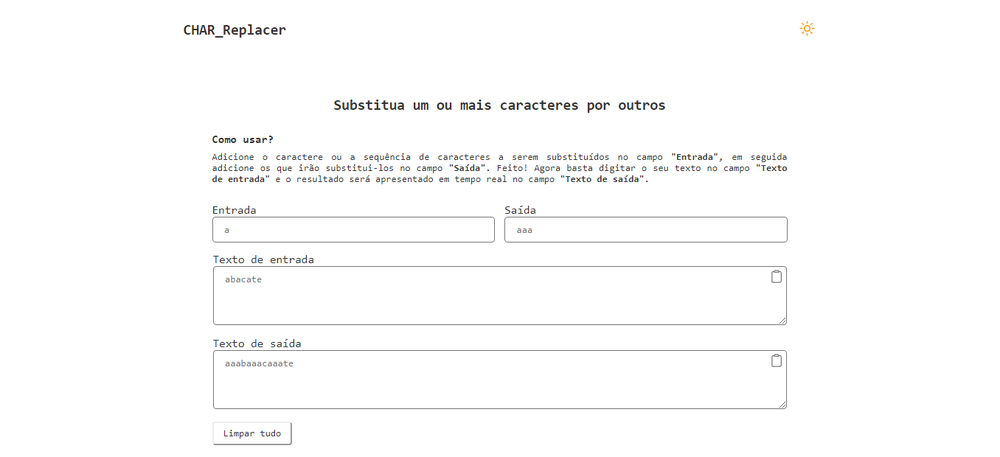

# Projeto | CHAR_Replacer

Feito como projeto de estudo.

Confira o resultado [clicando aqui.](https://char-replacer.vercel.app/) (Dica: segure Ctrl ao clicar para abrir em uma nova guia 😉)

## Design

## Techs usadas no desenvolvimento

- React
- TypeScript
- CSS Module
- HTML
- GIT

## Desenvolvido por

- [@jeanwisotscki](https://github.com/jeanwisotscki/)
